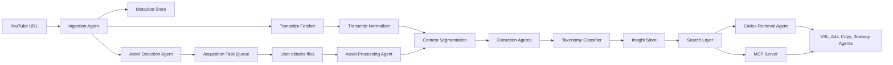
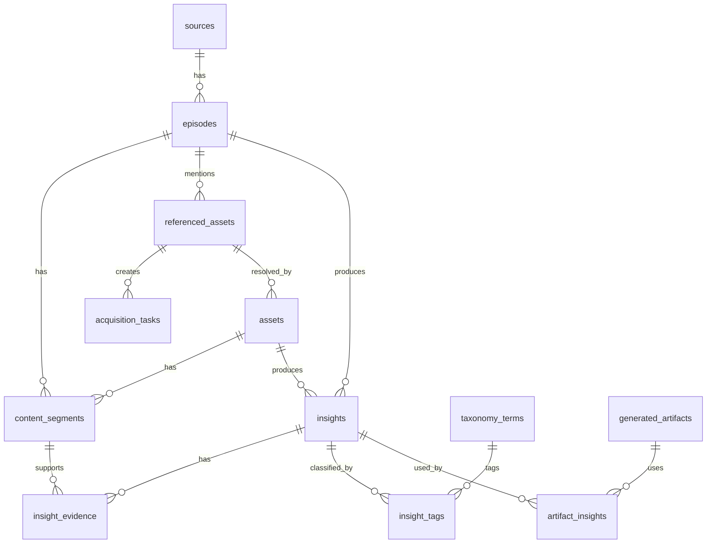

# Arquitetura - Marketing Swipe File

## 1. Decisao arquitetural central

Marketing Swipe File deve nascer Codex-first e evoluir para Supabase + MCP + agentes especializados.

Motivo:

- O objetivo inicial e validar qualidade de inteligencia, nao construir UI.
- O usuario quer evitar custo de API no inicio e usar recursos disponiveis no Codex.
- Agentes sao os principais consumidores da base.
- Materiais complementares exigem um fluxo semi-manual no comeco, porque muitos dependem de direct, comentario, area de membros ou login.
- Supabase continua sendo a fonte de verdade recomendada para a versao completa.
- MCP faz sentido assim que houver dados suficientes para varios agentes consultarem a mesma base por ferramentas padronizadas.

Arquitetura por fases:

- MVP: links manuais, transcricoes do YouTube, deteccao de materiais complementares, extracao por Codex, dados estruturados locais e importaveis para Supabase.
- Versao 2: skills atomicas para executar etapas repetiveis.
- Versao 3: loops compostos para processar episodios e arquivos.
- Versao 4: Supabase como banco principal, com SQL, filtros e busca textual.
- Versao 5: embeddings, busca semantica real, MCP server e agentes especializados.
- Versao 6: automacao de canais, UI e grafo de estrategia.

## 2. Pipeline logico



## 3. Componentes

### 3.1 Ingestion Agent

Responsabilidades:

- Receber URL do YouTube.
- Extrair video_id, canal, titulo, descricao, data e duracao.
- Verificar se o episodio ja existe.
- Criar registro de episodio.
- Disparar coleta de transcricao.
- Disparar deteccao de materiais complementares.

MVP:

- Entrada manual por arquivo `data/input/youtube_urls.csv` ou comando.
- Saida em JSON por episodio.

### 3.2 Transcript Fetcher

Responsabilidades:

- Buscar transcricao automatica do YouTube.
- Preservar idioma original.
- Guardar timestamps.
- Registrar falhas e indisponibilidade.

MVP:

- Preferir transcript automatico do YouTube.
- Se indisponivel, marcar episodio como `transcript_missing`.

Futuro:

- Fallback com Whisper/OpenAI ou outro transcritor, caso custo seja aprovado.

### 3.3 Asset Detection Agent

Responsabilidades:

- Ler titulo, descricao, links publicos e transcricao.
- Detectar mencoes a materiais complementares.
- Identificar palavras-chave, chamadas para direct, comentarios, areas de membros, links externos e instrucoes verbais.
- Criar registros de material referenciado.
- Criar tarefas de aquisicao quando o material depender do usuario.

Exemplos de sinais:

- "comenta VSL que eu te mando"
- "chama no direct com a palavra funil"
- "o PDF esta na descricao"
- "a planilha esta na area de membros"
- "vou deixar o template aqui"
- "baixem esse checklist"

Saidas:

- `referenced_assets.json`
- `acquisition_tasks.json`
- `manual_actions.md`

### 3.4 Acquisition Task Queue

Fila de pendencias manuais.

Status:

- `detected`
- `needs_user_action`
- `obtained`
- `processing`
- `processed`
- `unavailable`
- `discarded`

Cada tarefa deve conter:

- episodio
- timestamp ou trecho da mencao
- tipo provavel de material
- instrucao de obtencao
- prioridade
- campo para caminho do arquivo quando o usuario inserir

### 3.5 Asset Processing Agent

Responsabilidades:

- Processar arquivos inseridos pelo usuario.
- Extrair texto e estrutura de PDFs, DOCX, XLSX, CSV, PPTX, paginas HTML e imagens com texto.
- Preservar arquivo bruto.
- Segmentar por pagina, secao, slide, aba, linha ou bloco.
- Detectar frameworks, copies completas, exemplos, templates, checklists, prompts e mapas.
- Gerar segmentos normalizados para os mesmos extratores usados na transcricao.

Diretorios recomendados:

```text
data/input/assets/{video_id}/
data/raw/assets/{asset_id}/
data/processed/assets/{asset_id}/content_segments.json
data/processed/assets/{asset_id}/insights.json
```

### 3.6 Content Segmentation

Unifica transcricao e arquivos complementares em um formato comum.

Campos por segmento:

- `source_kind`
- `episode_id`
- `asset_id`
- `segment_index`
- `start_seconds`
- `end_seconds`
- `page_number`
- `sheet_name`
- `cell_range`
- `slide_number`
- `section_title`
- `text_original`
- `text_ptbr`
- `language`

### 3.7 Extraction Agents

Extratores iniciais:

- Strategy extractor: posicionamento, mercado, crescimento, lancamento, escala.
- Copy extractor: hooks, headlines, leads, promessas, mecanismos, objecoes, CTAs.
- Offer extractor: ofertas, stacks, garantias, precificacao, bonus, urgencia.
- VSL extractor: estrutura narrativa, lead, problema, mecanismo, prova, fechamento.
- Ads extractor: angulos, criativos, padroes de anuncio, claims, testes.
- Funnel extractor: funis, paginas, checkout, upsell, remarketing.
- Ops extractor: processos, gestao, time, producao, rituais.
- Product extractor: avatar, dores, desejos, produto, retencao.
- Asset extractor: frameworks, templates, swipes, planilhas, exemplos e copies completas de arquivos complementares.

Cada extrator gera insights atomicos com evidencia.

### 3.8 Taxonomy Classifier

Classifica cada insight por:

- tema
- subtema
- nivel
- etapa do funil
- tipo de ativo
- tipo de fonte
- nicho
- papel de agente
- aplicabilidade
- confianca

Tambem sugere novos temas quando encontra padroes repetidos.

### 3.9 Search Layer

Camadas de busca:

1. Busca estruturada por filtros SQL.
2. Busca textual por full-text search.
3. Busca semantica por embeddings.
4. Retrieval orientado a tarefa, que combina filtros, semantica e reranking por agente.

MVP sem custo de API:

- Busca por texto, tags e filtros.
- Retrieval feito pelo Codex lendo dados estruturados.

Versao completa:

- Supabase Postgres com `pgvector`.
- Embeddings por insight, trecho, episodio e material complementar.
- Reranking por relevancia para tarefa.

### 3.10 Codex Skills, Loops e Agentes

O melhor caminho e nao criar agentes autonomos cedo demais. Primeiro validar procedimentos como prompts e scripts, depois transformar o que se repete em skills, depois compor loops, e so entao criar agentes.

Skills atomicas propostas:

- `marketing-swipe-file-ingest`: cadastrar episodio, coletar metadados e iniciar pipeline.
- `marketing-swipe-file-detect-assets`: detectar materiais complementares e criar tarefas de aquisicao.
- `marketing-swipe-file-process-assets`: processar PDFs, docs, planilhas, slides e paginas.
- `marketing-swipe-file-extract-insights`: extrair insights atomicos com evidencia.
- `marketing-swipe-file-taxonomy`: classificar e sugerir expansoes de taxonomia.
- `marketing-swipe-file-retrieve`: montar strategy packs para tarefas.
- `marketing-swipe-file-quality-review`: auditar evidencia, duplicacao e utilidade.
- `marketing-swipe-file-output-eval`: comparar outputs com e sem base.

Loops compostos:

- Episode ingestion loop: URL -> metadata -> transcript -> asset detection -> tasks.
- Asset acquisition loop: material detectado -> alerta -> arquivo inserido -> processamento.
- Insight extraction loop: segmentos -> extratores -> dedupe -> taxonomia -> master export.
- Quality loop: amostra de insights -> checagem de evidencia -> correcao/reprocessamento.
- Strategy pack loop: tarefa de agente -> retrieval -> pacote de contexto -> referencias.
- Output creation loop: strategy pack -> VSL/anuncios -> registro dos insights usados.

Agentes entram depois:

- Producer agents alimentam o Marketing Swipe File.
- Consumer agents usam o Marketing Swipe File para criar estrategia e conteudo.
- Evaluator agents medem se os outputs melhoraram.

### 3.11 MCP Server

Recomendacao: criar MCP depois que o schema e os tipos de consulta estiverem estaveis.

Ferramentas MCP propostas:

- `search_insights(query, filters, limit)`
- `get_insight(insight_id)`
- `get_evidence(insight_id)`
- `search_episodes(query, filters)`
- `search_assets(query, filters)`
- `get_episode_context(episode_id)`
- `get_asset_context(asset_id)`
- `get_strategy_pack(task, niche, asset_type, constraints)`
- `get_vsl_references(product, avatar, market, limit)`
- `get_ad_references(product, avatar, platform, limit)`
- `record_artifact_usage(artifact_id, insight_ids, agent_name)`
- `submit_feedback(target_id, rating, notes)`

O MCP deve retornar dados com evidencia, nao apenas conclusoes.

## 4. Fluxo do MVP

### 4.1 Entrada

Arquivo:

```text
data/input/youtube_urls.csv
```

Campos:

```csv
source_priority,channel_name,youtube_url,episode_priority,notes
1,VTurb,https://www.youtube.com/watch?v=...,1,episodio piloto
```

Materiais complementares obtidos pelo usuario:

```text
data/input/assets/{video_id}/
```

### 4.2 Artefatos intermediarios

Por episodio:

```text
data/raw/youtube/{video_id}/metadata.json
data/raw/youtube/{video_id}/transcript_original.json
data/processed/{video_id}/content_segments.json
data/processed/{video_id}/referenced_assets.json
data/processed/{video_id}/acquisition_tasks.json
data/processed/{video_id}/manual_actions.md
data/processed/{video_id}/insights.json
data/processed/{video_id}/episode_summary.md
```

Por material complementar:

```text
data/raw/assets/{asset_id}/metadata.json
data/raw/assets/{asset_id}/original_file
data/processed/assets/{asset_id}/content_segments.json
data/processed/assets/{asset_id}/insights.json
data/processed/assets/{asset_id}/asset_summary.md
```

## 5. Modelo de dados

### 5.1 Entidades principais



### 5.2 Tabelas principais

#### sources

- `id`
- `name`
- `platform`
- `youtube_channel_id`
- `base_url`
- `priority_order`
- `status`
- `created_at`
- `updated_at`

#### episodes

- `id`
- `source_id`
- `youtube_video_id`
- `url`
- `title`
- `description`
- `published_at`
- `duration_seconds`
- `language_original`
- `processing_status`
- `transcript_status`
- `asset_detection_status`
- `processed_at`
- `created_at`
- `updated_at`

#### referenced_assets

Materiais complementares mencionados no episodio, mesmo antes de serem obtidos.

- `id`
- `episode_id`
- `name`
- `asset_type_guess`
- `mention_source`
- `mention_start_seconds`
- `mention_end_seconds`
- `mention_quote_original`
- `mention_quote_ptbr`
- `acquisition_instruction`
- `expected_value`
- `status`
- `priority`
- `created_at`
- `updated_at`

Status:

- `detected`
- `needs_user_action`
- `obtained`
- `processed`
- `unavailable`
- `discarded`

#### acquisition_tasks

Acao manual ou semi-manual para obter um material.

- `id`
- `referenced_asset_id`
- `episode_id`
- `task_type`
- `instruction`
- `status`
- `due_priority`
- `user_notes`
- `result_asset_id`
- `created_at`
- `updated_at`

Tipos:

- `comment_keyword`
- `send_direct_message`
- `open_description_link`
- `access_member_area`
- `download_public_file`
- `request_from_participant`
- `manual_search`

#### assets

Arquivos complementares obtidos.

- `id`
- `referenced_asset_id`
- `episode_id`
- `source_id`
- `original_filename`
- `storage_path`
- `mime_type`
- `asset_type`
- `language_original`
- `processing_status`
- `checksum`
- `created_at`
- `processed_at`

Tipos:

- `pdf`
- `doc`
- `spreadsheet`
- `slides`
- `image`
- `html`
- `text`
- `other`

#### content_segments

Segmentos normalizados de transcricoes, descricoes, comentarios e arquivos.

- `id`
- `episode_id`
- `asset_id`
- `source_kind`
- `segment_index`
- `start_seconds`
- `end_seconds`
- `page_number`
- `sheet_name`
- `cell_range`
- `slide_number`
- `section_title`
- `text_original`
- `text_ptbr`
- `language`
- `created_at`

`source_kind`:

- `transcript`
- `asset`
- `description`
- `comment`

#### insights

Unidade atomica de inteligencia.

- `id`
- `episode_id`
- `asset_id`
- `title`
- `insight_original`
- `insight_ptbr`
- `summary_ptbr`
- `level`
- `insight_type`
- `strategic_value`
- `applicability`
- `confidence_score`
- `review_status`
- `language_original`
- `source_agent`
- `dedupe_key`
- `created_at`
- `updated_at`

Valores iniciais de `insight_type`:

- `principle`
- `framework`
- `example`
- `warning`
- `tactic`
- `template`
- `case`
- `quote`
- `hypothesis`
- `playbook_step`
- `complete_copy`
- `partial_copy`
- `spreadsheet_model`
- `checklist`

#### insight_evidence

- `id`
- `insight_id`
- `episode_id`
- `asset_id`
- `content_segment_id`
- `start_seconds`
- `end_seconds`
- `page_number`
- `sheet_name`
- `cell_range`
- `slide_number`
- `quote_original`
- `quote_ptbr`
- `evidence_strength`
- `created_at`

#### taxonomy_terms

Tipos iniciais:

- `theme`
- `subtheme`
- `niche`
- `funnel_stage`
- `asset_type`
- `source_kind`
- `agent_role`
- `market`
- `mechanism`
- `objection`
- `promise`

Termos iniciais incluem:

- anuncios
- criativos
- hooks
- VSL
- ofertas
- funil
- copy
- quiz
- low ticket
- high ticket
- framework
- template
- swipe
- planilha
- checklist

#### generated_artifacts e artifact_insights

Registram outputs criados por agentes e quais insights foram usados em cada output.

## 6. Busca e retrieval

### 6.1 Consulta orientada a tarefa

Entrada:

```json
{
  "task": "criar VSL",
  "product": "produto exemplo",
  "avatar": "empreendedor digital",
  "market": "infoprodutos",
  "constraints": ["lead forte", "3 variacoes", "baseado em VTurb"]
}
```

Processo:

1. Identificar asset_type: `VSL`.
2. Filtrar insights por temas de VSL, oferta, copy, prova, mecanismo e objecoes.
3. Priorizar insights com evidencia forte.
4. Dar peso maior a materiais complementares quando contiverem frameworks, exemplos ou copies completas.
5. Agrupar por etapa: lead, problema, promessa, mecanismo, prova, oferta e CTA.
6. Retornar pacote de contexto.

### 6.2 Strategy pack

```json
{
  "task": "vsl",
  "recommended_angles": [],
  "usable_insights": [],
  "asset_references": [],
  "evidence": [],
  "frameworks": [],
  "warnings": [],
  "open_questions": []
}
```

## 7. Contratos de dados para agentes

### Material complementar detectado

```json
{
  "episode_video_id": "abc123",
  "asset_type_guess": "pdf",
  "mention_quote_original": "Comenta VSL que eu mando o PDF com o modelo completo.",
  "mention_start_seconds": 1842,
  "acquisition_instruction": "Comentar a palavra VSL ou pedir o PDF conforme instrucao do episodio.",
  "status": "needs_user_action",
  "priority": "high"
}
```

### Insight atomico

```json
{
  "title": "Hook deve prometer ganho especifico sem revelar todo o mecanismo",
  "insight_ptbr": "Quando o criativo entrega curiosidade e especificidade, ele aumenta a chance de clique sem matar a tensao da VSL.",
  "level": "tactical",
  "insight_type": "principle",
  "themes": ["hooks", "anuncios", "VSL"],
  "applicability": ["copywriter de anuncios", "copywriter de VSLs"],
  "source_kind": "transcript",
  "evidence": [
    {
      "episode_title": "Exemplo",
      "start_seconds": 742,
      "quote_original": "..."
    }
  ],
  "confidence_score": 0.84
}
```

## 8. Estrategia de qualidade

Checks obrigatorios:

- Insight sem evidencia nao deve ser usado em output final sem aviso.
- Insight com baixa confianca deve ser marcado como hipotese.
- Episodio sem transcricao deve ficar em fila de fallback.
- Material complementar mencionado deve ter status explicito.
- Arquivo complementar processado deve ter evidencia por pagina, aba, celula, slide ou trecho.
- Reprocessamento deve usar `dedupe_key` e checksum de arquivo.
- Cada output de agente deve listar os insights usados.

Avaliacoes:

- Comparar VSL gerada sem base vs com base.
- Avaliar leads por clareza, curiosidade, especificidade, promessa, mecanismo e aderencia ao avatar.
- Avaliar anuncios por angulo, scroll-stopper, prova, plausibilidade e fit com plataforma.
- Avaliar se materiais complementares melhoraram a qualidade do output.

## 9. Seguranca e Supabase

Se Supabase expuser dados por API:

- Ativar RLS em tabelas do schema publico.
- Separar chaves de servico e chaves publicas.
- Nunca expor service role em cliente.
- Criar politicas especificas por usuario/projeto se houver multiusuario.
- Preferir schema privado para tabelas internas se nao houver UI publica.

No MVP local/Codex, o risco principal e organizacao, rastreabilidade e controle de arquivos obtidos manualmente.

## 10. Recomendacao final sobre MCP

MCP deve entrar apos a base ter:

- Pelo menos 20 episodios processados.
- Materiais complementares detectados e alguns processados.
- Schema estabilizado.
- Consultas recorrentes identificadas.
- Primeiro output de VSL e anuncios validado.

Antes disso, a melhor sequencia e:

1. Extrair dados.
2. Validar prompts e scripts.
3. Criar skills atomicas.
4. Compor loops.
5. Consultar via Codex/scripts.
6. Identificar os 5 a 10 comandos de consulta mais usados.
7. Transformar esses comandos em ferramentas MCP.
